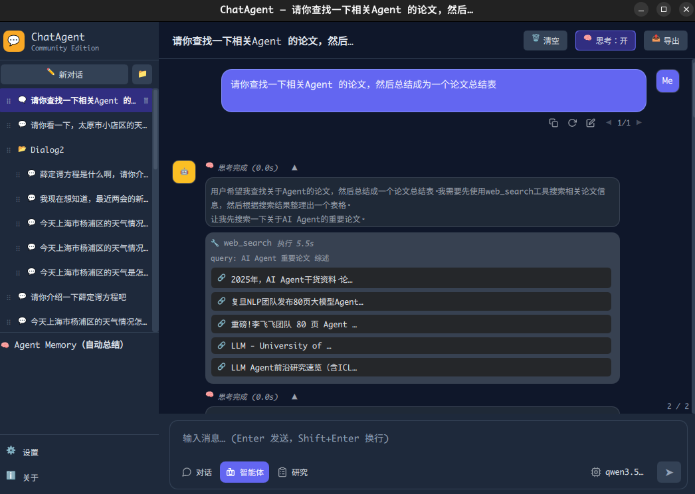

# ChatAgent



基于 Qt 6 + QML 的本地 AI Agent 客户端。支持 OpenAI 兼容 API（通义、DeepSeek 等）。

## 特点

- **三模式**：Chat（纯对话）/ Agent（ReAct 工具调用）/ Planning（规划拆解）
- **九大工具**：文件、Shell、网页搜索、键盘、OCR、窗口、剪贴板、等待、图像匹配
- **记忆**：短期滚动窗口 + 长期 SQLite 持久化，自动注入上下文
- **ReAct 编排**：意图识别 → 工具选择 → 执行 → 反思，多轮循环
- **原生桌面**：Qt 6，无 Electron，Discord 风格深色主题，跨平台
- **流式输出**：SSE 流式、Markdown+LaTeX 渲染、推理过程可视化
- **会话管理**：多会话、文件夹拖拽、消息编辑与重新生成

## 构建与运行

项目支持 **Linux、macOS、Windows** 三平台。

| 平台     | 构建并运行 |
|----------|------------|
| Linux    | `./run.sh`（可设置 `QT_INSTALL_DIR` 覆盖默认 Qt 路径） |
| macOS    | `./run.sh`（默认 Qt 路径 `~/Qt/6.10.2/macos`） |
| Windows  | `.\run.ps1`（可设置 `$env:QT_INSTALL_DIR` 指定 Qt 路径） |

仅 **Linux** 支持打包 deb：`./generate.sh`（生成自包含 .deb 安装包）。

手动构建示例（Linux/macOS）：

```bash
mkdir build && cd build
cmake -DCMAKE_PREFIX_PATH=/path/to/Qt/6.x.x/gcc_64 -DCMAKE_BUILD_TYPE=Release ..
cmake --build . --parallel
./appChatAgent   # macOS 可能为 ./appChatAgent.app/Contents/MacOS/appChatAgent
```

## 依赖

- Qt 6（Core, Gui, Quick, QuickControls2, Network, Sql, WebEngineQuick, WebChannel）
- 可选：`wmctrl` / `xdotool`（窗口/键盘）、`tesseract`（OCR）、`opencv-python`（图像匹配）

## 工具调用是如何实现的？

- **Agent 模式 + ReAct 协议**：在 Agent 模式下，前端会将对话历史、当前指令以及可用工具的说明（名称、参数 JSON Schema、返回格式等）一起发送给模型，请求其按 ReAct 风格（“先思考，再选择工具”）生成回复。
- **模型产生工具调用计划**：模型返回的内容中如果包含工具调用（例如 OpenAI function calling / tool calling 的 `tool_calls`），前端会解析出结构化指令：`{ tool_name, arguments }`，并根据名称路由到对应的本地工具实现。
- **本地工具执行层**：每一个工具（文件、Shell、网页搜索、键盘/窗口/剪贴板、OCR、图像匹配、等待等）在本地都有独立的执行模块，统一做参数校验、日志记录和错误捕获，只暴露有限能力，避免任意代码执行或危险路径访问。
- **结果回注对话循环**：工具执行结束后，会将结构化结果（stdout、文件内容摘要、截图/OCR 文本、搜索结果等）作为一条新的「工具结果消息」追加进对话，再次发给模型，让其基于最新环境状态继续思考、生成最终自然语言回复或进一步的工具调用，从而形成多轮 ReAct 闭环。
